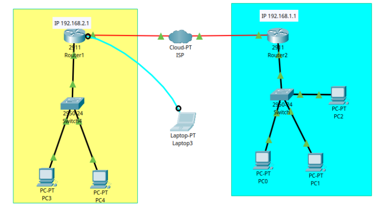

# Documentación de Laboratorio — Enrutamiento Estático entre Dos Sucursales

## 1. Objetivo
Configurar dos routers Cisco (2911) ubicados en sitios distintos, cada uno con su propia LAN, interconectados a través de un enlace WAN simulado (Cloud-PT / ISP), y verificar la comunicación entre ambas redes.

## 2. Topología



- **Sitio 1 (amarillo):** Router1 + Switch + PC3, PC4
- **Sitio 2 (celeste):** Router2 + Switch + PC0, PC1, PC2
- **Interconexión:** Router1 y Router2 unidos a través de un dispositivo Cloud-PT (ISP), simulando un enlace WAN de fibra.

## 3. Direccionamiento IP

| Dispositivo | Interfaz | IP | Máscara | Red |
|---|---|---|---|---|
| Router1 | Gi0/0 (LAN) | 192.168.2.1 | 255.255.255.0 | 192.168.2.0/24 |
| Router1 | Gi0/0/0 (WAN) | 200.1.1.2 | 255.255.255.252 | enlace WAN |
| Router2 | Gi0/0 (LAN) | 192.168.1.1 | 255.255.255.0 | 192.168.1.0/24 |
| Router2 | Gi0/0/0 (WAN) | 200.1.1.1 | 255.255.255.252 | enlace WAN |
| PC0, PC1, PC2 | — | 192.168.1.3/24 | 255.255.255.0 | Gateway: 192.168.1.1 |
| PC3, PC4 | — | 192.168.2.3/24 | 255.255.255.0 | Gateway: 192.168.2.1 |

## 4. Configuración aplicada

### Router1
```
enable
configure terminal
hostname Router1
interface GigabitEthernet0/0
 ip address 192.168.2.1 255.255.255.0
 no shutdown
 exit
interface GigabitEthernet0/1
 ip address 200.1.1.2 255.255.255.252
 no shutdown
 exit
end
write memory
```

### Router2
```
enable
configure terminal
hostname Router2
interface GigabitEthernet0/0
 ip address 192.168.1.1 255.255.255.0
 no shutdown
 exit
interface GigabitEthernet0/1
 ip address 200.1.1.1 255.255.255.252
 no shutdown
 exit
end
write memory
```

### Configuración de PCs
IP fija asignada manualmente en cada equipo (Desktop > IP Configuration), con el gateway correspondiente a su router local.

## 5. Verificación de interfaces

**Router1 — `show ip interface brief`:**


**Router2 — `show ip interface brief`:**


Ambas interfaces LAN y WAN muestran estado up/up, confirmando que la conectividad física y el direccionamiento básico están correctos en ambos routers.

## 6. Problema detectado

Al realizar la prueba de conectividad entre sitios:
```
PC3 > ping 192.168.1.1   (o ping hacia PC1)
```


### Diagnóstico
- Las interfaces de ambos routers están activas (up/up), por lo que el problema no es de capa física.
- Cada router únicamente conoce las redes directamente conectadas a él (su propia LAN y su propio tramo del enlace WAN).
- Ninguno de los routers tiene información de enrutamiento hacia la red LAN del sitio remoto (192.168.1.0/24 desde Router1, o 192.168.2.0/24 desde Router2).
- Causa raíz: falta de rutas (estáticas o dinámicas) que le indiquen a cada router cómo llegar a la red del otro sitio.

### Causa raíz
El Cloud-PT genérico de Packet Tracer está diseñado para emular servicios de ISP con equipos intermedios (módem DSL, módem de cable), no para actuar como un puente Ethernet-a-Ethernet simple entre dos routers conectados directamente.

### Solución aplicada
Se sustituyó el dispositivo Cloud-PT por un **Switch 2960-24TT (Switch5)**, conectado directamente a las interfaces `GigabitEthernet0/0` de ambos routers. Al ser un dispositivo de Capa 2, distribuye el tráfico entre sus puertos sin necesidad de configuración ni mapeos adicionales. Tras el cambio, se repitió la configuración de interfaces y rutas estáticas en los routers (identificados por Packet Tracer como Router1 y Router2).


## 7. Resultado final — confirmado

Tras aplicar el cambio de topología (switch en lugar de nube) y reconfigurar los routers, la prueba de conectividad extremo a extremo fue exitosa:


## 8. Conclusión
El problema no se debía al direccionamiento IP ni a las rutas estáticas, que estaban correctamente configuradas desde el inicio, sino a una limitación del dispositivo Cloud-PT de Packet Tracer para actuar como puente Ethernet directo entre dos routers. La sustitución por un switch de Capa 2 resolvió la conectividad de forma inmediata y sin necesidad de configuración adicional.
